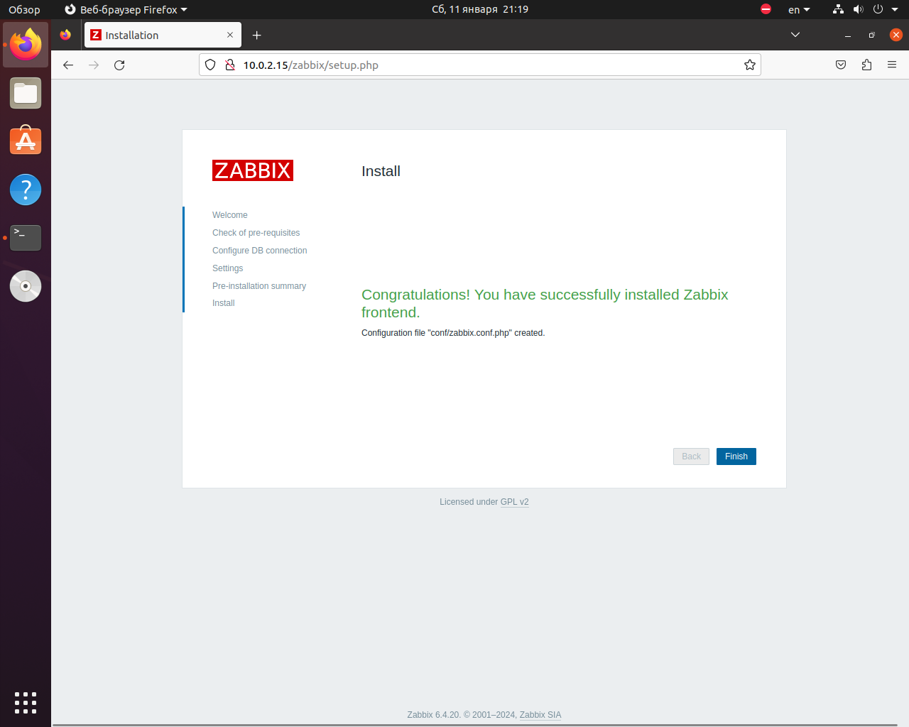
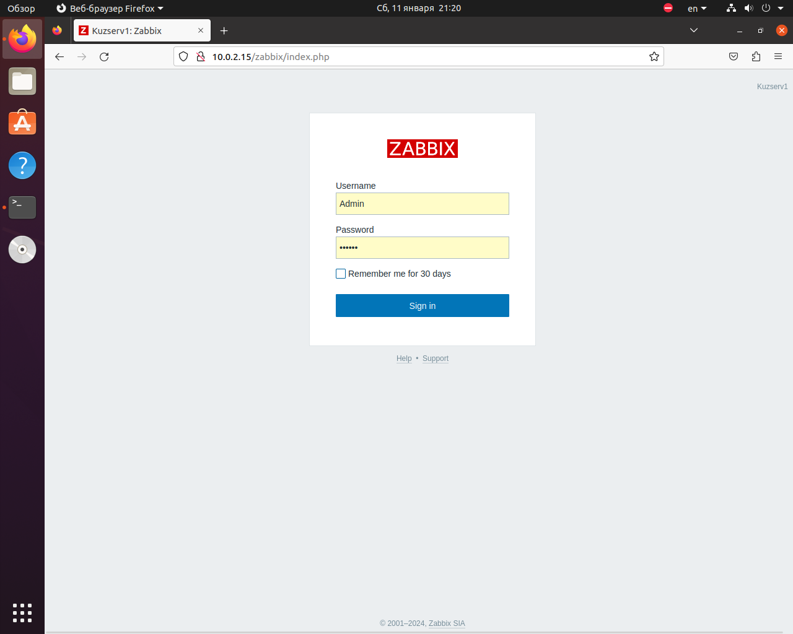
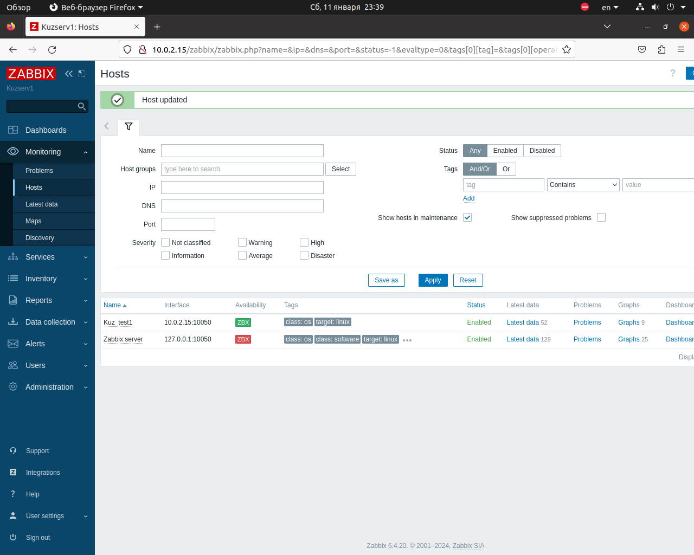
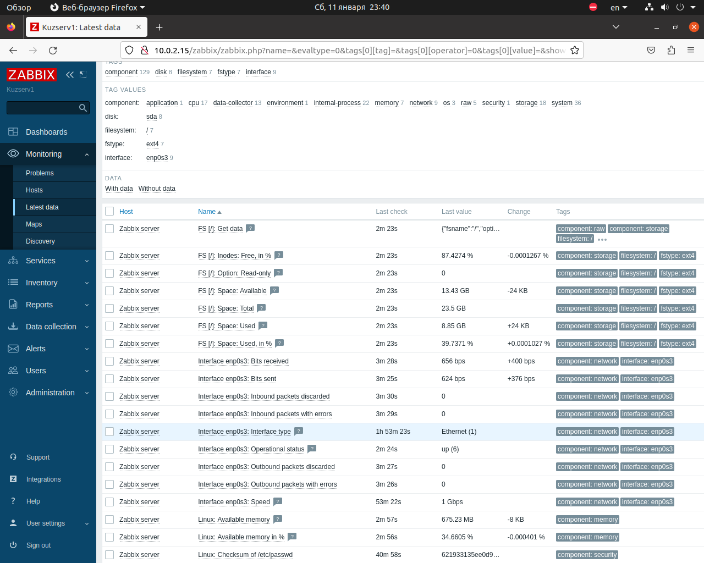
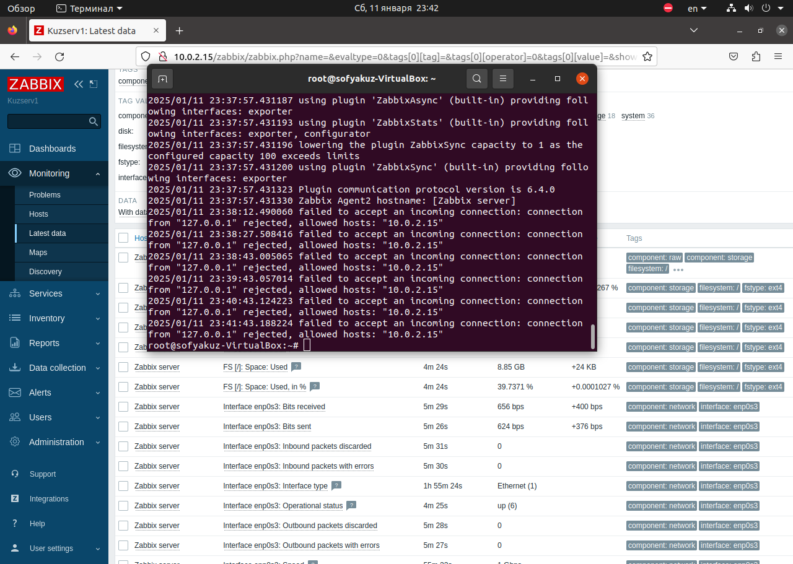

# Домашнее задание к занятию "`Git`" - `Кузьминова Софья`

1. #### Задание 1 Установите Zabbix Server с веб-интерфейсом

## Процесс выполнения
1. Выполняя ДЗ, сверяйтесь с процессом отражённым в записи лекции.
2. Установите PostgreSQL. Для установки достаточна та версия, что есть в системном репозитороии Debian 11.
3. Пользуясь конфигуратором команд с официального сайта, составьте набор команд для установки последней версии Zabbix с поддержкой PostgreSQL и Apache.
4. Выполните все необходимые команды для установки Zabbix Server и Zabbix Web Server.
5. Требования к результаты
6. Прикрепите в файл README.md скриншот авторизации в админке.
7. Приложите в файл README.md текст использованных команд в GitHub.

dpkg --remove-architecture i386 — отключение архитектуры i386

sudo apt update && sudo apt install -y postgresql — список команд для апгрейда версии postgresql с 12 на 17

dpkg --get-selections | grep post

sudo apt-get -y install postgresql-17

dpkg --get-selections | grep post

pg_lsclusters

sudo service postgresql stop

sudo pg_renamecluster 17 main main_pristine

sudo pg_upgradecluster 12 main

dpkg --get-selections | grep postgres

a. Установите репозиторий Zabbix

Документация
wget https://repo.zabbix.com/zabbix/6.4/ubuntu/pool/main/z/zabbix-release/zabbix-release_latest_6.4+ubuntu20.04_all.deb
dpkg -i zabbix-release_latest_6.4+ubuntu20.04_all.deb
apt update

b. Install Zabbix server, frontend

apt install zabbix-server-pgsql zabbix-frontend-php php7.4-pgsql zabbix-apache-conf zabbix-sql-scripts

c. Создайте базу данных

Установите и запустите сервер базы данных.

Выполните следующие комманды на хосте, где будет распологаться база данных.

При автоматизации с помощью bash можно использовать следующие примеры:

Создание пользователя с помощью psql из-под root

su - postgres -c 'psql --command "CREATE USER zabbix WITH PASSWORD
'\'123456789\'';"'

su - postgres -c 'psql --command "CREATE DATABASE zabbix OWNER zabbix;"

На хосте Zabbix сервера импортируйте начальную схему и данные. Вам будет предложено ввести недавно созданный пароль.

zcat /usr/share/zabbix-sql-scripts/postgresql/server.sql.gz | sudo -u zabbix psql zabbix

d. Настройте базу данных для Zabbix сервера
Отредактируйте файл /etc/zabbix/zabbix_server.conf
sed -i 's/# DBPassword=/DBPassword=123456789/g' /etc/zabbix/zabbix_server.conf

e. Запустите процессы Zabbix сервера
Запустите процессы Zabbix сервера и настройте их запуск при загрузке ОС.
systemctl restart zabbix-server apache2
#systemctl enable zabbix-server apache2

Установка Zabbix agent2
 Установите репозиторий Zabbix
Документация
wget https://repo.zabbix.com/zabbix/6.4/ubuntu/pool/main/z/zabbix-release/zabbix-release_latest_6.4+ubuntu20.04_all.deb
dpkg -i zabbix-release_latest_6.4+ubuntu20.04_all.deb
apt update

c. Установите Заббикс aгент2
  apt install zabbix-agent2 zabbix-agent2-plugin-*
d. Запустите процесс Zabbix агента2
Запустите процесс Zabbix агента2 и настройте его запуск при загрузке ОС.
systemctl restart zabbix-agent2
systemctl enable zabbix-agent2

Замена адреса сервера в агенте Zabbix на  VM 1
sed -i 's/Server=127.0.0.1/Server=`10.0.2.15'/g' /etc/zabbix/zabbix_server.conf

Перезапуск агента

sudo systemctl restart zabbix-agent2

2. #### Задание 2 Установите Zabbix Agent на два хоста.
## Процесс выполнения
1. Выполняя ДЗ, сверяйтесь с процессом отражённым в записи лекции.
2. Установите Zabbix Agent на 2 вирт.машины, одной из них может быть ваш Zabbix Server.
3. Добавьте Zabbix Server в список разрешенных серверов ваших Zabbix Agentов.
4. Добавьте Zabbix Agentов в раздел Configuration > Hosts вашего Zabbix Servera.
5. Проверьте, что в разделе Latest Data начали появляться данные с добавленных агентов.
6. Требования к результаты
7. Приложите в файл README.md скриншот раздела Configuration > Hosts, где видно, что агенты подключены к серверу
8. Приложите в файл README.md скриншот лога zabbix agent, где видно, что он работает с сервером
9. Приложите в файл README.md скриншот раздела Monitoring > Latest data для обоих хостов, где видны поступающие от агентов данные.
10. Приложите в файл README.md текст использованных команд в GitHub

